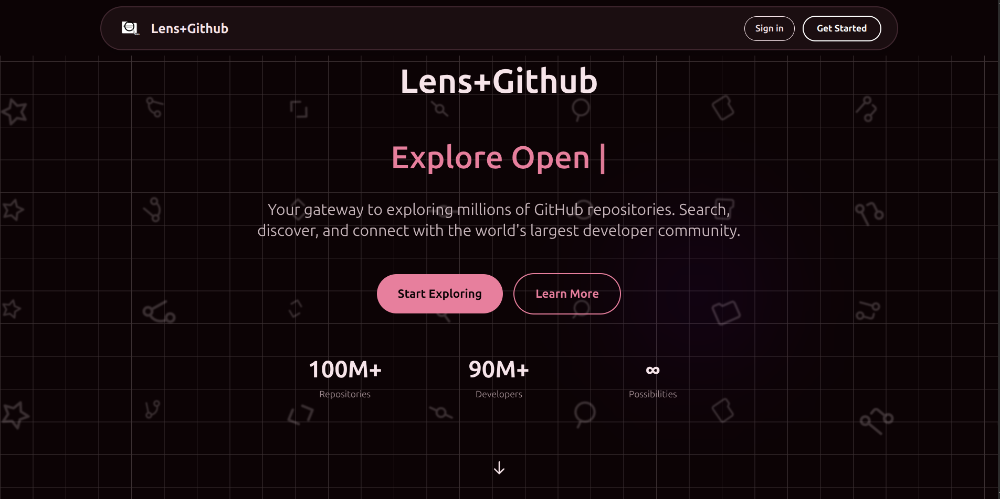

# Lens+GitHub Repository Search

A modern, secure web application for searching and discovering GitHub repositories with advanced filtering capabilities and GitHub OAuth integration.



## 🚀 Live Demo

**Frontend**: [https://lensgithub.netlify.app/](https://lensgithub.netlify.app/)  
**Backend API**: [https://aibos-github-api.onrender.com](https://aibos-github-api.onrender.com)

## Overview

This application provides an intuitive interface to search through GitHub's vast repository database with powerful filtering options. Users can authenticate with their GitHub account to access enhanced search capabilities and avoid rate limits.

## Features

- **Advanced Search**: Search repositories with custom queries and filters
- **Smart Filtering**: Filter by programming language, minimum stars, and sort options
- **GitHub OAuth**: Secure authentication with GitHub for enhanced API access
- **Responsive Design**: Modern UI with dark/light mode support
- **Pagination**: Navigate through large result sets efficiently
- **Real-time Results**: Fast search with loading states and error handling

## Tech Stack

### Backend
- **FastAPI**: Modern Python web framework
- **Pydantic**: Data validation and settings management
- **HTTPX**: Async HTTP client for GitHub API integration
- **Uvicorn**: ASGI server for production deployment

### Frontend
- **React 19**: Latest React with modern hooks
- **Vite**: Fast build tool and development server
- **TailwindCSS**: Utility-first CSS framework
- **Lucide React**: Beautiful icon library
- **React Router**: Client-side routing

## Project Structure

```
├── backend/                 # FastAPI backend
│   ├── models/             # Pydantic data models
│   ├── routers/            # API route handlers
│   ├── main.py             # Application entry point
│   └── config.py           # Configuration settings
├── frontend/               # React frontend
│   ├── src/
│   │   ├── components/     # React components
│   │   ├── contexts/       # React contexts
│   │   └── assets/         # Static assets
│   └── public/             # Public assets
└── README.md
```

## Quick Start

### Prerequisites
- Python 3.12+
- Node.js 18+
- GitHub OAuth App (for authentication)

### Backend Setup
1. Navigate to backend directory:
   ```bash
   cd backend
   ```

2. Install dependencies:
   ```bash
   pip install -e .
   ```

3. Create `.env` file with your GitHub OAuth credentials:
   ```env
   GITHUB_CLIENT_ID=your_client_id
   GITHUB_CLIENT_SECRET=your_client_secret
   FRONTEND_URL=http://localhost:5173
   ```

4. Start the server:
   ```bash
   python main.py
   ```

### Frontend Setup
1. Navigate to frontend directory:
   ```bash
   cd frontend
   ```

2. Install dependencies:
   ```bash
   npm install
   ```

3. Create `.env` file:
   ```env
   VITE_BACKEND_URL=http://localhost:8000
   ```

4. Start development server:
   ```bash
   npm run dev
   ```

## API Endpoints

### Authentication
- `GET /auth/github` - Initiate GitHub OAuth flow
- `GET /auth/callback` - Handle OAuth callback

### Search
- `GET /api/search` - Search repositories with filters
  - Query parameters: `q`, `language`, `min_stars`, `sort`, `order`, `page`, `per_page`
- `GET /api/user` - Get authenticated user information

## Environment Variables

### Backend
- `GITHUB_CLIENT_ID` - GitHub OAuth app client ID
- `GITHUB_CLIENT_SECRET` - GitHub OAuth app client secret
- `FRONTEND_URL` - Frontend application URL

### Frontend
- `VITE_BACKEND_URL` - Backend API base URL

## Development

The application uses modern development practices:
- Type-safe API with Pydantic models
- Async/await for optimal performance
- Component-based React architecture
- Responsive design with TailwindCSS
- Error handling and loading states

## 🚀 Deployment

### Production URLs
- **Frontend**: [https://lensgithub.netlify.app/](https://lensgithub.netlify.app/) (Netlify)
- **Backend**: [https://aibos-github-api.onrender.com](https://aibos-github-api.onrender.com) (Render)

### Security Features
- ✅ **CSRF Protection**: State parameter validation in OAuth flow
- ✅ **Secure Cookies**: HTTP-only cookies for token storage
- ✅ **Input Validation**: Comprehensive API input sanitization
- ✅ **CORS Security**: Restricted to specific origins
- ✅ **Rate Limiting**: GitHub API rate limit handling
- ✅ **Error Handling**: No sensitive information disclosure

### Deployment Stack
- **Frontend**: Netlify (Static hosting with CDN)
- **Backend**: Render (Python web service)
- **Authentication**: GitHub OAuth 2.0
- **Database**: Stateless (uses GitHub API)

## License

This project is licensed under the MIT License - see the LICENSE file for details.
